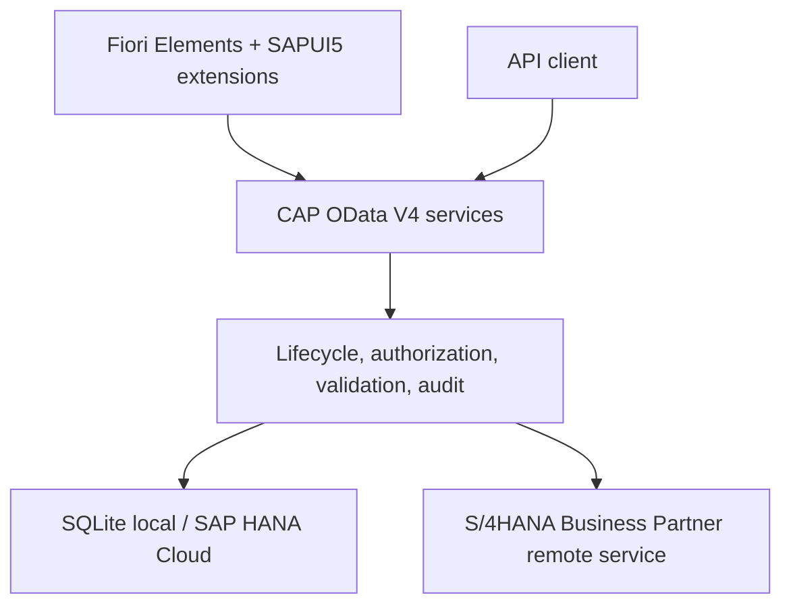
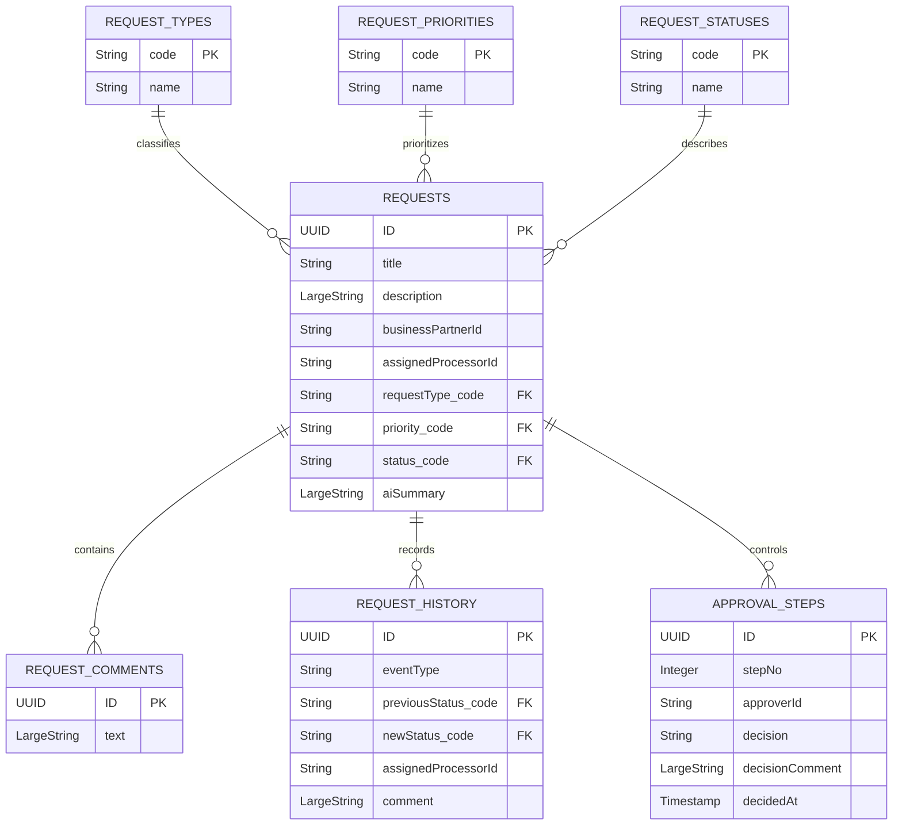
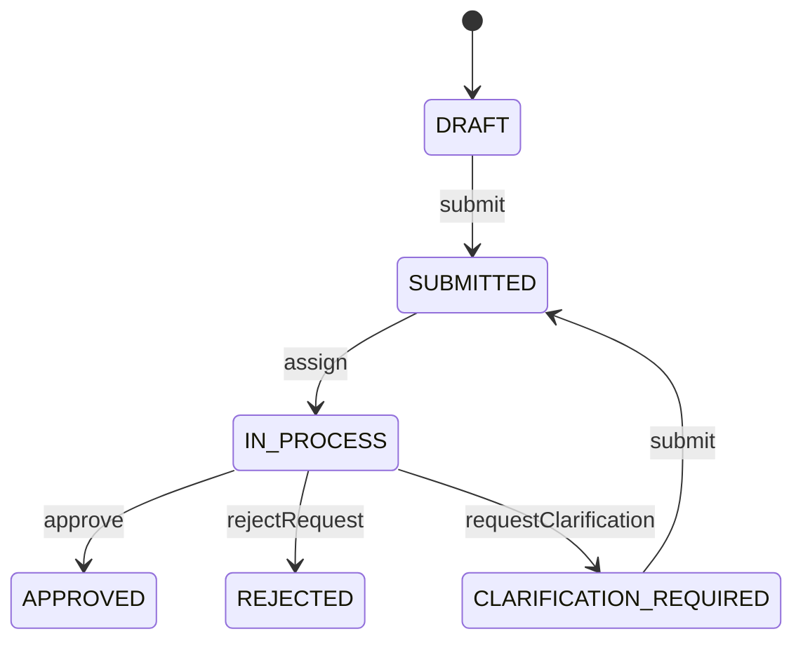

# Request Hub Portfolio Architecture

## Purpose

This document provides the three diagrams used in the Portfolio MVP v1.0.0 walkthrough: runtime architecture, domain data model, and request lifecycle. Detailed design decisions remain in the dedicated architecture and security documents.

## Runtime Architecture

Key boundaries:

- Fiori and API consumers use the same backend rules.
- CAP handlers implement lifecycle behavior and transactional history updates.
- Local persistence uses SQLite; the BTP deployment uses SAP HANA Cloud through an HDI container.
- Business Partner data remains owned by SAP S/4HANA and is read through a remote-service boundary.
- Local development mocks the remote service; production configuration uses a destination.

## Domain Data Model

`Requests` is the aggregate root. Comments, history, and approval steps are compositions because their lifecycle belongs to the request. Type, priority, and status are controlled reference entities. `businessPartnerId` is intentionally stored as an external identifier rather than as a replicated Business Partner entity.

## Request Lifecycle

The backend validates every transition. A successful transition updates the request and creates the matching history record within the same request-processing flow. Invalid repeated or incomplete transitions are rejected without adding a false history entry.

## Security Overlay

| Role | Instance rule |
|---|---|
| Requester | Access is restricted to requests created by the authenticated user |
| Processor | Read and processing access is restricted to requests assigned to the authenticated user; assignment is separately authorized |
| Admin | Full access to the exposed operational services |

The role-aware UI only guides the user. CAP service and instance restrictions enforce the actual security boundary.
