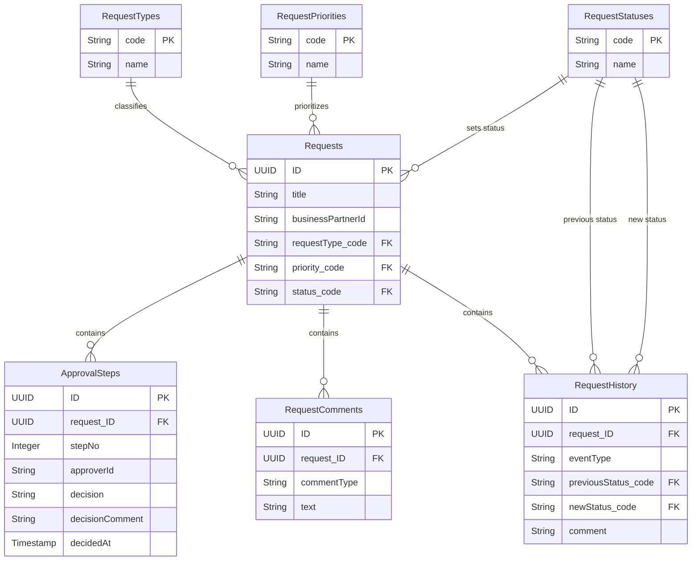

# Request Hub ER Diagram

```mermaid

erDiagram
    Requests ||--o{ RequestComments : "contains"
    Requests ||--o{ RequestHistory : "contains"
    Requests ||--o{ ApprovalSteps : "contains"

    RequestTypes ||--o{ Requests : "classifies"
    RequestPriorities ||--o{ Requests : "prioritizes"
    RequestStatuses ||--o{ Requests : "sets status"

    RequestStatuses ||--o{ RequestHistory : "previous status"
    RequestStatuses ||--o{ RequestHistory : "new status"

    Requests {
        UUID ID PK
        String title
        String businessPartnerId
        String requestType_code FK
        String priority_code FK
        String status_code FK
    }

    RequestComments {
        UUID ID PK
        UUID request_ID FK
        String commentType
        String text
    }

    RequestHistory {
        UUID ID PK
        UUID request_ID FK
        String eventType
        String previousStatus_code FK
        String newStatus_code FK
        String comment
    }

    ApprovalSteps {
        UUID ID PK
        UUID request_ID FK
        Integer stepNo
        String approverId
        String decision
        String decisionComment
        Timestamp decidedAt
    }

    RequestTypes {
        String code PK
        String name
    }

    RequestPriorities {
        String code PK
        String name
    }

    RequestStatuses {
        String code PK
        String name
    }
```